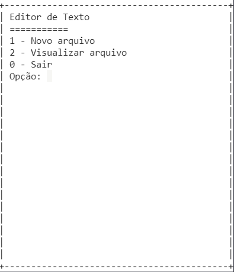

# Editor de Texto 2.0

## Objetivos

Projeto criado para testar o método Regex em C#

## Funcionalidades

<ul>
<li>Criar um novo arquivo TXT</li>
<li>Salvar um novo arquivo</li>
<li>Deixar um texto em vermelho utilizando a tag < strong> </li>
</ul>

## Imagem do projeto

</img>